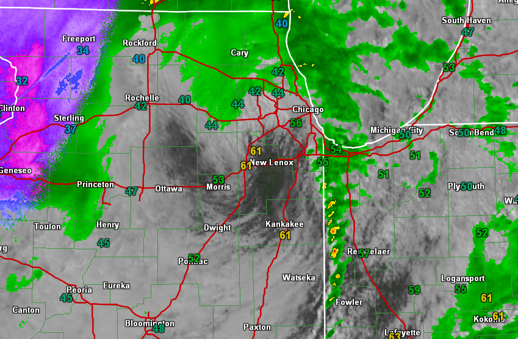

# Carson Hall

### Experties- BS In Geography, Minor in Communcations, Certificate in Geographic information systems.
+ climatological/data analysts.
 + Skills in Gis
  + Data gathering
  +  analizing climate with topography*

 + ##### Overall goal to help bridge the gap between physical geography, human geography, and GIS science!  :smile:

   

### Projects 
+ Fire risk for westeren NC realated to hurricane Helene.
+ Watershed maps with hydo focus.
+ Live data maps abouy vegatation damage due to recent storms.  

### Professional experince 
+ Work with for google for data management and risks. 
+ Worked remote job for Appen.

 

<a href="https://www.appstate.edu/">My School</a>

